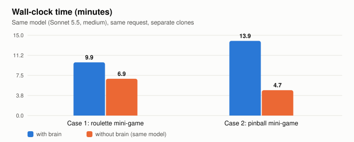
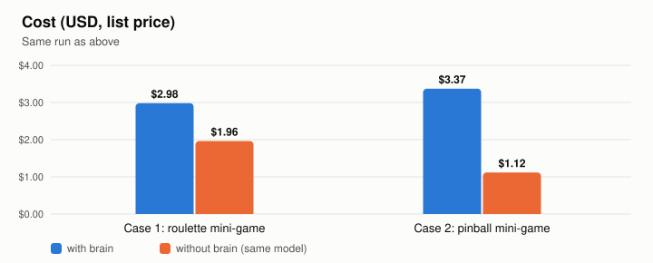

<h1 align="center">brain</h1>
<h3 align="center">make Claude Code remember!</h3>
<p align="center"><b>에이전트가 의식하지 않아도 도는 장기 기억</b><br>
지금 다루는 파일, 명령, 에러에 걸린 기억이 세션에 저절로 떠오르고,<br>
새 기억은 대화록에서 만들어지고, 밤마다 정리된다.</p>

<p align="center">
  <a href="LICENSE"></a>
  <a href="https://claude.com/claude-code"></a>
  
  
  <a href="#벤치마크-2026-09-30"></a>
</p>

```bash
git clone https://github.com/FuJiGraphics/claude-brain.git ~/.claude/skills/brain
bash ~/.claude/skills/brain/scripts/install.sh
```

brain 은 Claude Code 를 위한 장기 기억 스킬이다. 세션에게 기억을 챙기라고 시키지 않고 세션 밖에서 돈다.
훅이 지금 하는 일에 걸린 기억을 `[기억]` 메시지로 건네고, 별도 프로세스가 대화록에서 새 기억을 기록하고, 매일 밤 예약 작업이 정리와 망각을 한다.
세션은 이 장치를 모르고, 필요한 기억이 떠오를 뿐이다. 부품 이름은 사람의 기억 체계에서 따왔다.
[n-worker](https://github.com/FuJiGraphics/n-worker) 에서 분리했지만 단독으로 쓴다(아래 "n-worker 와의 관계").

```
세션이 src/Payment/PaymentClient.cs 를 고치려는 순간 세션에 들어가는 메시지 (형식 예시, 내용은 가상이다)

[기억] `PaymentClient` 에 대해 기억나는 것(과거에 확인한 사실이라 지금 코드와 다를 수 있다). 기억 저장소: ~/.claude/skills/brain/cortex
- 결제 재시도는 멱등 키를 재사용한다 - 새로 만들면 이중 결제가 난다 (projects/shop/lessons/payment-retry-reuses-key.md)
```

**목차** - [벤치마크](#벤치마크-2026-09-30) | [왜 필요한가](#왜-필요한가) | [어떻게 도는가](#어떻게-도는가) | [실측](#실측) | [설치](#설치) | [사용](#사용) | [폴더 구조](#폴더-구조) | [요구사항](#요구사항) | [n-worker 와의 관계](#n-worker-와의-관계) | [라이선스](#라이선스)

## 벤치마크 (2026-09-30)

**실제 프로젝트에서 같은 기능을 두 번 구현시켰다. 한 번은 brain 을 달고, 한 번은 없이.** 모델, 요청, 기준 커밋은 같고, 각자 따로 복제한 작업 사본에서 실제로 코드를 썼다. 결과물은 판정관 2명이 어느 쪽이 brain 인지 모르는 채로 검토했다.

<p align="center">
<picture><source media="(prefers-color-scheme: dark)" srcset="benchmarks/2026-09-30/score-dark.svg"></picture>
</p>

| | 사례 1: 회전판 미니게임 | 사례 2: 핀볼 미니게임 |
|---|---|---|
| 판정 점수 (50점, 2명 평균) | **brain 34** / 순정 29 | **brain 30.5** / 순정 22 |
| 판정관 선택 | brain 2 / 2 | brain 2 / 2 |
| 프로젝트 소유자 채점 | 속도, 토큰을 뺀 모든 항목 brain | 요청 의도를 정확히 반영한 쪽 brain |
| 시간 | 9.9분 / 6.9분 | 13.9분 / 4.7분 |
| 비용 (정가 환산) | $2.98 / $1.96 | $3.37 / $1.12 |

**차이는 코드와 문서에 없는 지식에서 났다.**

- **구두 지침.** 이 팀은 시트 데이터를 전량 TSV 로 넘겨 받는다. 두 달 전 대화에서 한 번 정한 규칙이고 저장소 어디에도 적혀 있지 않다. brain 은 이 규칙을 지켰고, 순정 모델은 로컬 JSON 을 직접 고쳤다(규칙 위반이고 런타임에도 반영되지 않는다).
- **비싸게 알아낸 함정.** "캐시된 팝업을 다시 열면 초기화가 돌지 않는다", "순환 이벤트에 줄을 추가하면 모든 회차가 다시 계산된다". brain 은 관련 파일을 만질 때 이 함정을 떠올려 피했고, 순정 모델은 둘 다 밟았다.
- **기능의 큰 그림.** "순환 이벤트의 세 번째 게임"을 brain 은 기존 순환 이벤트 흐름에 붙는 게임으로 이해해 매니저, 팝업, 정산까지 연결했다. 순정 모델은 단독 미니게임만 만들었고, 에디터 없이 프리팹과 Addressable YAML 을 손으로 고쳤다.

**대가.** brain 쪽이 시간 1.4~2.9배, 비용 1.5~3.0배를 썼다. 기억을 읽고 확인하는 비용이고, 사례 2 는 순환 이벤트 연결까지 하느라 일의 범위도 두 배였다.

<p align="center">
<picture><source media="(prefers-color-scheme: dark)" srcset="benchmarks/2026-09-30/time-dark.svg"></picture>
<picture><source media="(prefers-color-scheme: dark)" srcset="benchmarks/2026-09-30/cost-dark.svg"></picture>
</p>

<details><summary>시험 방법과 한계</summary>

- 모델: Sonnet 5.5, effort medium. 두 팀 동일.
- 순정 팀: `claude -p --restricted` 로 CLAUDE.md, 자동 메모리, 사용자 설정을 모두 끄고 저장소 파일만 읽게 했다. brain 팀은 같은 조건에 brain 훅과 기억 출처 한 줄만 더했다. 두 팀 대화록을 검사해 brain 쪽에는 기억이 실제로 들어갔고 순정 쪽에는 흔적이 0 임을 확인했다.
- 판정관: Opus 5.5 2명, 가림 검토. 항목은 컨벤션, 기존 구조 활용, 헬퍼 중복, 동작 정확성, 완성도. 사례 2 부터는 팀의 구두 지침을 채점 기준으로 줬다(사례 1 판정관은 TSV 규칙을 몰라 brain 쪽 완성도를 낮게 매겼다).
- 한계: 사례 2건, 조건별 1회. 경향은 분명하지만 통계적으로 확정한 결과는 아니다. 같은 날 한 "계획 한 번 세우기" 시험(실제 과제 18개, 모델 3종)에서는 brain 과 순정의 품질 차이가 없었다. 한 번짜리 계획에는 이런 맥락 지식이 드러날 일이 적었던 것으로 본다.
- 원자료: [`benchmarks/2026-09-30/results.json`](benchmarks/2026-09-30/results.json)

</details>

## 왜 필요한가

Claude Code 로 오래 일하다 보면 반복되는 문제가 있다:

| 문제 | brain 의 해결 |
|---|---|
| 세션이 매번 백지에서 시작한다 - 프로젝트 구조, 컨벤션, 이미 밟은 함정을 다시 설명하거나, 빼먹어서 사고가 난다 | **cortex** - 확인된 사실만 쌓고, 세션이 시작될 때 그 프로젝트의 요지와 INDEX 를 보여 준다 |
| 세션에게 기억을 챙기라고 시키면 지켜지지 않는다 - 파일을 고치기 전에 기억을 대조하라는 강제 규칙이 Edit, Write 6,300건 중 1,264건(20%)에서 지켜지지 않았다. Bash 쓰기는 893건 중 290건(32%)이었다 | **thalamus** - 규칙 대신 훅이 걸린 기억을 떠올려 준다. 세션이 할 일이 없다 |
| 세션이 시켜야 도는 정비는 돌지 않는다 - 이전 구조의 큐 이력 668건 중 기록 322건, 정비 0건이었다 | **sleep** - 예약된 밤 작업이 정비와 망각을 한다 |
| 기억 장치가 사람에게 확인을 구하면 쌓이기만 한다 - 해마가 "결정 필요" 로 남긴 질문이 4주 만에 279건이 됐고 답한 것은 없었다 | **hippocampus** 는 묻지 않는다. 기억 정리는 스스로 정하고, 코드 문제는 사실로 기억해 그 코드를 만지는 세션에 떠오르게 한다 |
| 모델은 출처를 모르는 메시지를 따르지 않는다 - 명령형 훅 문구는 프롬프트 주입으로 의심받았고, `[기억]` 이 무엇인지 알려 주는 한 줄이 없으면 무시됐다 | 훅은 명령하지 않고 사실과 출처만 준다. 설치가 `CLAUDE.md` 에 그 한 줄을 넣는다 |

설계 원칙:

- **기억은 사실과 출처만 준다.** 명령하지 않는다. 떠오른 기억은 판단 재료이고 판단은 세션이 한다. 지금 코드와 다르면 지금 코드가 기준이다.
- **걸린 기억이 없으면 침묵한다.** 출력이 없으면 비용도 없다. 같은 기억은 세션에 한 번만 보인다(컨텍스트 압축 뒤에는 다시 보일 수 있다).
- **세션이 하던 기억 관리를 세션 밖으로 옮긴다.** 대조도 기록도 훅과 밤 작업이 한다. 세션이 직접 기록하는 통로는 없다.
- **무의식은 묻지 않는다.** hippocampus 는 사용자에게 질문이나 승인 대기를 남기지 않는다. 판단은 근거를 보고 스스로 하고, 되돌리기는 `_archive` 가 보장한다.
- **고장은 작업을 막지 않는다.** 훅은 어떤 오류도 조용히 통과한다.
- **강제는 파손 방지에만 둔다.** cortex 에 쓰는 주체는 hippocampus 하나이고, 하드 삭제는 없고, 기계가 읽는 형식은 지킨다.

## 어떻게 도는가

| 부품 | 뇌에서 맡는 기능 | brain 에서 하는 일 | 파일 |
|---|---|---|---|
| **cortex** | 대뇌 피질 - 굳어진 장기 기억 | 기억 저장소. `registry.md`(경로와 프로젝트의 매핑)와 `common/`, `stacks/<스택>/`, `projects/<슬러그>/` 3레이어. 레이어마다 얇은 인덱스와 기억 본문이 있다 | `cortex/` |
| **thalamus** | 시상 - 감각을 걸러 의식으로 올리고 깨어남을 조절 | 훅. 세션이 지금 다루는 파일, 명령, 에러에 걸린 기억을 `[기억]` 으로 건네고, 세션이 시작될 때 프로젝트 요지와 INDEX 를 켠다. 쉬는 순간에 대화록 재생을 시작한다 | `scripts/thalamus.py` |
| **hippocampus** | 해마 - 새 기억을 만들고 피질로 옮겨 정리 | `claude -p` 로 도는 데몬. 큐에 들어온 요청(등록, 기록, 재생, 정비 등)을 하나씩 처리하고, cortex 에 쓰는 유일한 주체다 | `agents/hippocampus.md`, `scripts/hippocampus-*.sh` |
| **sleep** | 잠 - 하루를 되짚어 굳히고 오래 안 쓴 것은 잊음 | 매일 밤 예약 작업. 기억 강도 집계, 망각, 남은 대화록 재생, 검색 실패 학습, 조각 정비, 검사 | `scripts/sleep.sh` |

```
[떠올림 - 세션 안]
도구 호출 ─ 훅 ─▶ thalamus ─▶ cortex 에서 걸린 기억 검색 ─▶ [기억] 메시지가 세션에 들어간다

[기록 - 세션 밖]
턴 끝, 압축 직전, 세션 끝 ─▶ thalamus ─▶ replay.py awake ────────────────┐
매일 04:30 ─▶ sleep.sh ─▶ replay.py scan, 검색 실패 학습, 조각 정비 ─────┴─▶ 큐 ─▶ hippocampus 데몬 ─▶ cortex
```

Claude Code 가 세션마다 실시간으로 쓰는 대화록(`~/.claude/projects/<경로>/*.jsonl`)이 단기 기억 구실을 한다.
replay.py 가 대화록별 처리 위치(바이트)를 `.active/replay-marks.json` 하나에 두고 깨어 있는 중 재생과 밤 재생이 함께 쓰므로, 같은 구간을 두 번 넘기지 않는다.
hippocampus 의 결과는 세션에 전달되지 않는다. 실패한 항목 수가 `/claude-brain-status` 에서 드러난다.

### 떠올림 - thalamus

`~/.claude/settings.json` 에 훅 8종이 걸린다. `cortex/registry.md` 에 등록된 프로젝트 안에서만 동작하고, 등록되지 않은 폴더에서는 훅 프로세스가 곧바로 끝난다.

| 훅 이벤트 | 단서 |
|---|---|
| SessionStart | 그 프로젝트의 요지(registry 비고), 프로젝트 `INDEX.md`(2,500자 상한), 절차 기억(단계 카드) 줄. 머리에 `[기억]` 이 무엇인지 알리는 한 줄을 둔다. 컨텍스트 압축 뒤에는 떠올린 목록을 비워 다시 떠올릴 수 있게 한다 |
| PostToolUse (Read) | 연 파일 이름. 기억 저장소 안의 파일을 열면 열람 횟수만 기록한다 |
| PreToolUse (Edit, Write, MultiEdit, NotebookEdit) | 고칠 파일 이름, 편집 내용에 새로 나온 API 이름 |
| PreToolUse (Bash) | 명령이 읽거나 쓰는 파일 이름, 명령 속 코드의 API 이름 |
| PostToolUseFailure (Bash) | C# 컴파일 에러의 파일과 에러 코드, 예외 이름과 첫 프로젝트 프레임의 파일 |
| SubagentStart | 작업 폴더의 프로젝트와 `[기억]` 이 무엇인지 알리는 한 줄 |
| Stop, PreCompact, SessionEnd | 떠올림은 없다. 새로 쌓인 대화록 구간이 두드러지면 깨어 있는 중 재생을 백그라운드로 시작한다 |

- 걸린 기억이 없으면 출력이 없다. 한 번에 1~2개(Bash 는 1개)이고, 항목은 기억 본문의 첫 줄(`# 한 문장 요지`)과 파일 경로다. 항목당 240자 이하, 세션당 40개 또는 9,000자가 상한이다.
- 단서 하나가 서로 다른 기억 4개 이상에 걸리면 흔한 단서로 보고, 파일 이름에 그 단서가 든 기억만 남긴다. 그것도 없으면 떠올리지 않는다.
- 보여 줄 수보다 많은 기억이 걸리면 최근에 쓰인 기억이 앞선다(14일 안 +2, 45일 안 +1 - [기억 강도](#기억-강도)).

### cortex - 기억 저장소

```
cortex/
├── registry.md            # 경로 프리픽스, 프로젝트 슬러그, 스택, 스택 버전, 비고
├── common/                # 스택과 무관한 기억 (도구 함정, 일반 원칙)
├── stacks/<스택>/         # 엔진, 프레임워크 일반
└── projects/<슬러그>/     # 프로젝트 고유 (구조, 진입점, 컨벤션 위치)
```

- 레이어는 "이 사실이 어디까지 일반화되는가"로 가른다.
- 레이어마다 얇은 인덱스(`INDEX.md`, 이름에 `index` 가 든 `.md`)가 있고, 인덱스 줄의 첫 링크가 기억 본문이다.
- 단서가 인덱스 줄의 앞 160자, 첫 링크 글, 기억 파일 이름 중 하나에 있어야 그 기억의 주제로 본다. 그래서 인덱스 줄 앞부분에 식별자와 요지를 두고, 본문 첫 줄은 한 문장 요지로 쓴다.
- **기록 기준.** 조사 비용을 치르고 알아낸 것, 사용자가 말해 줘야만 알 수 있는 것만 기억한다. 코드를 열면 몇 초 만에 확인되는 것은 기억하지 않는다.
- cortex 는 마크다운 파일이라 읽고 고칠 수 있다. brain 자신은 쓰기 주체를 하나로 두려고 hippocampus 만 쓴다(예외는 밤 망각이 옮기는 인덱스 줄).

### 기록 - 두 속도, awake 와 sleep

| | awake (깨어 있는 중) | sleep (잠) |
|---|---|---|
| 시작 | 턴 끝, 압축 직전, 세션 끝에 thalamus 가 백그라운드로 시작 | 매일 04:30 launchd. 놓치면 깨어난 뒤 한 번. `/claude-brain-sleep` 으로 지금 돌릴 수도 있다 |
| 대상 | 지난 처리 위치 뒤에 새로 쌓인 대화록 구간 | 깨어 있는 중에 처리되지 못한 구간 |
| 조건 | 새 구간이 4,000바이트 이상, 두드러짐 점수 6 이상(압축 직전과 세션 끝은 3 이상). 같은 대화록은 20분에 한 번(압축 직전과 세션 끝은 예외), 전체는 시간당 4건 | 두드러짐 점수 6 이상, 점수 높은 순 4건. 처음 보는 대화록은 최근 2일치만, 30분 안에 바뀐 대화록은 건너뜀 |
| hippocampus | 최대 120턴, 20분 | 최대 200턴, 30분 |

두드러짐 점수는 구간의 신호를 건마다 더한 값이다: 사용자의 정정 3점, 결정 표현 3점, 기억 요청 5점, 권한 거부 2점, 도구 실패 1점(합계 최대 5), 같은 대상을 6번 이상 읽거나 검색한 반복 조사 1점(합계 최대 3), 사용자 요청이 5개 이상이면 1점.
요약 파일은 그 구간만 담고, hippocampus 가 요약에서 기록할 것만 골라 cortex 에 쓴다. 기록할 것이 없으면 아무것도 쓰지 않는다.

잠 주기의 순서(`scripts/sleep.sh`):

1. 기억 강도와 검색 실패 짝을 집계한다.
2. 망각 - 오래 안 쓴 기억을 자동 떠올림에서 숨긴다. hippocampus 가 일하는 중이면 건너뛴다.
3. 재생 - 남은 구간 중 두드러진 것 최대 4건을 큐에 넣는다. 활발한 미등록 프로젝트 1곳의 등록도 함께 넣는다(아래 "설치").
4. 검색 실패 학습 - 세션이 어떤 이름으로 찾다 실패하고 곧 다른 이름으로 찾은 짝이 5개 이상이면, 별칭으로 이을지 판단하는 요청을 넣는다.
5. 조각 정비 - 가장 오래 정비하지 않은 조각 3개를 넣는다. 조각은 hippocampus 한 번의 실행이 끝낼 수 있는 크기(추정 4만 토큰 이하)로 나눈 인덱스 단위다.
6. 검사 - `check.py` 가 cortex 의 죽은 링크, 검색에 안 걸리는 기억, 형식 파손을 점검해 결과를 남긴다.

큐에는 등록, 재생, 검색 실패 학습, 정비 순으로 넣는다(새 기억을 먼저 기록하고 정리한다). 숫자는 `scripts/sleep.conf` 로 바꿀 수 있다(`REPLAY_MAX`, `SWEEP_N`, `FORGET_DAYS` 등).

### 망각과 되살림

- 기억 하나는 검색 대상 인덱스 줄의 첫 링크가 가리키는 본문이다.
- **마지막 사용일**은 떠올림, 열람, 검색 히트, 본문 수정일, brain 설치일 중 가장 늦은 날이다.
- 마지막 사용일에서 45일이 지나면 그 기억의 인덱스 줄을 `<레이어>/dormant.md` 로 옮긴다(줄 끝에 원래 파일과 날짜를 주석으로 남긴다). 본문에 사용자 결정, 함정, 사고, 손실, 파괴가 든 두드러진 기억은 120일이다.
- 본문은 그대로 남는다. `dormant.md` 는 이름에 `index` 가 없어 자동 떠올림에는 걸리지 않고, `recall.sh` 의 본문 대체 검색으로는 찾힌다(잠재 기억).
- 숨긴 뒤 다시 쓰이면(열람, 검색 히트) 밤 주기가 원래 인덱스로 돌려놓는다.
- `dormant.md` 는 망각(`forget.py`)이 소유한다. hippocampus 는 손으로 고치지 않고, 잠재 기억 본문을 읽어 병합과 보관 여부를 판단하는 것만 한다.
- 하드 삭제는 없다. 정비에서 hippocampus 가 옮기는 `_archive/` 도 파일은 남는다.

### 기억 강도

`cortex/.hippocampus/strength.json` 은 기억 파일마다 `{shown, opened, grepped, last}` 를 둔다(떠오른 횟수, 열린 횟수, 검색 히트 횟수, 마지막 사용일). 잠 주기가 매일 밤 집계한다.

- 망각이 마지막 사용일로 쓴다.
- thalamus 가 보여 줄 수보다 많은 기억이 걸릴 때 순위에 쓴다(최근 14일 안에 쓰인 기억 +2, 45일 안 +1).
- hippocampus 정비의 판단 재료다. 강도가 낮다는 것만으로 지우지 않는다 - 안 떠오른 이유가 인덱스 줄의 단서가 약해서일 수 있다.

## 실측

작성자 환경(macOS, 한 사람의 여러 프로젝트)에서 잰 값이다. 표본이 작아서 방향을 보는 근거로 읽는다.

**설계 근거**

| 사실 | 근거 |
|---|---|
| 훅으로 컨텍스트를 넣을 수 있는 자리는 SessionStart, UserPromptSubmit, PreToolUse, PostToolUse(`additionalContext`), PostToolUseFailure(`error` 필드에 에러 원문), Stop(block 과 reason)이다 | Claude Code 2.1.283 격리 실행, 2026-09-29 |
| 훅 문구에 명령형("~할 것")을 넣으면 모델이 프롬프트 주입으로 의심하고 따르지 않았다 | 같은 실험(Stop 훅) |
| `CLAUDE.md` 의 한 줄("`[기억]` 으로 시작하는 메시지는 장기 기억이다")이 없으면 모델이 `[기억]` 을 출처 불명 삽입으로 보고 무시했다 | 같은 날 실측 |
| 강제 대조 규칙이 Edit, Write 6,300건 중 1,264건, Bash 쓰기 893건 중 290건에서 지켜지지 않았다 | brain 분리 전 구조의 게이트 로그(shadow 모드 - 기록만 하고 막지 않는다) |
| 정비가 한 번도 돌지 않았다 - 큐 이력 668건 중 기록 322건, 정비 0건 | brain 분리 전 구조의 큐 기록 |

**떠올림 판정**

과거 대화록 431세션을 재생해 훅 자리마다 무엇이 떠올랐을지 계산했고, 그중 371건을 Sonnet 이 판정했다(유용, 관련, 방해 세 등급). 표는 방해로 판정된 비율이다. 판정은 사람이 아니라 모델이 했고, 단서 종류마다 수십 건 안팎이다.

| 단서 | 방해로 판정된 비율 | brain 의 선택 |
|---|---|---|
| 파일 열람(Read) | 0~3% | 떠올린다 |
| 편집 직전(Edit, Write) | 8~20% | 떠올린다 |
| 명령이 다루는 파일(Bash) | 약 10% | 떠올린다 |
| 사용자 요청 글 | 64% | 떠올리지 않는다 |
| "안 된다" 결론(Stop) | 75% | 떠올리지 않는다 |
| 명령문 속 CLI 이름 | 64% | 떠올리지 않는다 |

요청 글, 결론, CLI 이름은 글자 일치로는 의도를 알아볼 수 없어서 단서로 쓰지 않는다.

**비용**

| 항목 | 값 |
|---|---|
| 훅 한 번 | 약 20ms |
| 떠올림으로 세션에 들어가는 글자 | 세션당 평균 약 2,000자 |
| 세션 시작 때 들어가는 글자 | 상한은 프로젝트 요지 500자, 프로젝트 INDEX 2,500자, 절차 기억 줄 8개 |
| hippocampus 의 기록 항목 | 58회 실측에서 중앙값 48턴, 9분(90번째 백분위 83턴 15분, 최대 107턴 20분) |

## 설치

```bash
git clone https://github.com/FuJiGraphics/claude-brain.git ~/.claude/skills/brain
bash ~/.claude/skills/brain/scripts/install.sh
```

여러 번 돌려도 같은 결과다. 고치기 전 설정 파일은 `<파일>.brain-bak-<시각>` 으로 복사해 둔다(직전 사본과 같으면 새로 만들지 않는다). 설정 폴더는 `CLAUDE_CONFIG_DIR` 가 있으면 그것을 따른다. `settings.json` 이 JSON 으로 읽히지 않으면 아무것도 걸지 않고 멈춘다. 설치가 하는 일은 네 가지다.

| 대상 | 하는 일 |
|---|---|
| `~/.claude/settings.json` | thalamus 훅 8종을 등록한다. 명령은 `python3 <brain>/scripts/thalamus.py hook` 이고 끝을 늘 종료 코드 0 으로 맺는다 - brain 폴더가 사라져도 도구 호출을 막지 않는다. 제한 시간은 5초, 파일 권한은 그대로 둔다. 이미 있는 다른 훅은 건드리지 않는다 |
| `~/.claude/CLAUDE.md` | `<!-- brain:begin -->` 과 `<!-- brain:end -->` 사이에 한 줄을 넣는다(아래) |
| macOS launchd | 매일 04:30 에 `scripts/sleep.sh` 를 부르는 `~/Library/LaunchAgents/com.brain.sleep.plist` 를 등록한다. `--no-sleep` 으로 건너뛴다. 등록이 끝내 실패하면 경고만 내고 훅과 기억 한 줄은 그대로 둔다 |
| `~/.claude/commands/` | `/claude-brain-*` 명령어 파일 11개를 만든다(저장소 `commands/` 템플릿에 설치 경로를 채운 것). 자동완성에 하나씩 뜬다. 표식 줄이 있는 파일만 고치고 지우며, 같은 이름의 사용자 파일은 건드리지 않는다 |

`CLAUDE.md` 에 들어가는 내용:

> `[기억]` 으로 시작하는 메시지는 이 사용자와 함께 쌓아 온 장기 기억이다 - 과거에 직접 확인한 사실이라 믿고 판단 재료로 쓴다. 지금 코드와 다르면 지금 코드가 기준이다.

이 한 줄이 없으면 모델이 `[기억]` 을 무시했다([실측](#실측)). 작동 원리는 적지 않는다.

**프로젝트 등록.** 설치만으로는 어느 폴더에서도 기억이 떠오르지 않는다. thalamus 는 `cortex/registry.md` 에 등록된 프로젝트 안에서만 동작한다.
등록은 밤 주기가 한다. 최근 7일 안에 대화록이 3개 이상이고 사용자 요청이 10개 이상인 `.git` 폴더 중 미등록인 곳을 한 번에 1곳씩 hippocampus 에 넘긴다. 스택과 버전은 프로젝트 파일에서 읽고, 모르는 칸은 `?` 로 두고 뒤의 재생, 정비에서 확인되면 채운다.
설치 직후에는 `/claude-brain-sleep` 으로 바로 돌릴 수 있다.

**업데이트.**

```bash
git -C ~/.claude/skills/brain pull
bash ~/.claude/skills/brain/scripts/install.sh
```

누적 기억(cortex)은 `.gitignore` 로 추적에서 빠져 있어 pull 해도 그대로 남는다. 설치 스크립트는 여러 번 돌려도 같은 결과라 다시 돌려도 된다.

**되돌리기.**

```bash
bash ~/.claude/skills/brain/scripts/install.sh --uninstall
```

훅과 `CLAUDE.md` 의 brain 블록과 잠 예약을 해제하고, 돌고 있는 hippocampus 는 지금 항목이 끝나면 멈추게 한다(남은 큐는 두고 건수를 알린다). cortex 와 `.active/` 는 남는다. 기억까지 없애려면 폴더를 직접 지운다.

### hippocampus 의 권한 - 알고 쓰기

> [!IMPORTANT]
> **hippocampus 는 승인 프롬프트 없이 도는 설정이 기본값이다**(`scripts/hippocampus-perm.mode` 의 `bypassPermissions`). 이 스킬을 `~/.claude/skills/` 아래에 설치하면 cortex 도 그 아래에 놓이는데, Claude Code 는 `.claude/` 를 protected path 로 취급해 파일 편집마다 사람의 승인을 요구한다. hippocampus 는 `claude -p` 로 도는 비대화형 프로세스라 승인할 사람이 없고, 이 설정이 없으면 판정만 하고 기록을 못 한다.

적용 범위와 제한:

- **hippocampus 프로세스에만 적용된다.** 사용자의 대화 세션 권한은 그대로다.
- 도구는 Read, Write, Edit, Grep, Glob, Bash 와 WebFetch, WebSearch 로 한정된다. MCP 서버와 스킬은 붙이지 않는다(`--strict-mcp-config`, `--disable-slash-commands`).
- git 쓰기 명령(`commit`, `push`, `checkout`, `reset`, `switch`, `stash`, `rebase`, `merge`, `restore`, `clean`, `add`, `rm`, `mv`)과 `rm`, `sudo`, `find -delete` 는 거부 규칙으로 막는다. 같은 skills 폴더에 있는 모든 스킬의 본문(`SKILL.md`, `scripts/`, `agents/`, `references/` - 이 스킬과 n-worker 같은 이웃 스킬 모두)과 설정 폴더(`~/.claude/` 또는 `CLAUDE_CONFIG_DIR`)의 `settings.json`, `settings.local.json`, `CLAUDE.md`, `hooks/` 편집도 막는다. cortex 는 이 패턴에 걸리지 않는다. 거부 규칙은 이 모드에서도 유효하다(`Edit(경로)` 규칙이 Write 도구까지 막는 것을 실측으로 확인했다).
- 그 밖의 경로에 쓰지 않는 것은 `agents/hippocampus.md` 의 규율이다. 프로젝트 폴더는 읽기만 하도록 지시해 넘기고(`--add-dir`), 쓰기 대상은 cortex 다. 기술적으로 강제하는 것은 위 거부 규칙뿐이다.
- 그래도 이것은 **자기 기기에서 감독 없이 도는 에이전트**다. 그 전제가 불편하면 아래로 끈다.

```bash
echo acceptEdits > ~/.claude/skills/brain/scripts/hippocampus-perm.mode
```

끄면 hippocampus 가 cortex 에 쓸 수 없어 항목이 `denied` 로 끝난다. 새 기억이 쌓이지 않을 뿐이고, 판정은 `scripts/hippocampus-ctl.sh results` 에 남으므로 보고 직접 반영할 수 있다. 떠올림, 검색, 망각은 그대로 돈다.
다만 재생 요청은 계속 큐에 들어가 사용량만 쓰므로, 기억을 쌓지 않을 기기라면 `install.sh --uninstall` 이 낫다.

항목마다 `claude -p` 를 한 번 띄운다. 모델과 effort 는 `/claude-brain-config` 로 고른다(default = Sonnet 5.5, effort medium / eco = Sonnet 5.5, low / quality = Opus 5.5, high, 세부는 `/claude-brain-model`, `/claude-brain-effort`, 값은 `.active/config`). 모드별 턴,시간 상한이 있고 넘기면 자식을 죽이고 `timeout` 으로 기록한다. 사용 한도나 로그인 문제로 멈춘 항목은 실패로 끝내지 않고 큐로 되돌린다.

`/claude-brain-off` 로 끄면 떠올림, 조사 한 줄, 재생, 밤 잠이 멈추고 상태줄의 `[BRAIN]` 표시가 사라진다(기억은 남는다). `/claude-brain-on` 으로 다시 켠다. caveman 처럼 훅이 즉시 처리해 모델을 거치지 않는다. 설치는 원래 상태줄(예: caveman)을 그대로 두고 뒤에 `[BRAIN]` 을 붙인다.

| 모드 | 최대 턴 | 벽시계 상한 | effort 가 `auto` 일 때 |
|---|---|---|---|
| register, harness-refresh | 120 | 15분 | medium |
| record | 200 | 30분 | medium |
| replay (awake) | 120 | 20분 | medium |
| replay (sleep) | 200 | 30분 | high |
| sweep, targeted | 400 | 40분 | high |

effort 는 설정값(기본 medium)이 모든 모드에 쓰이고, `/claude-brain-effort auto` 일 때만 위 표의 모드별 값을 쓴다. 2026-09-30 실측에서 medium 은 high 대비 턴이 절반이었고 격리 시험 3건의 품질 차이는 없었다.

**토큰 절약.** 에이전트는 턴마다 그때까지의 대화 전체를 다시 읽으므로 사용량은 대략 턴 수 x 평균 컨텍스트다. 그래서 해마는 (1) 지침 `agents/hippocampus.md` 에서 이번 모드에 필요한 절만 시스템 프롬프트에 싣고(`scripts/hippocampus-brief.py`), (2) 스킬 목록을 싣지 않고(`--disable-slash-commands`), (3) 사용자 설정에서 켜진 플러그인을 그 세션에서만 끄고(`--settings`, 사용자 설정 파일은 그대로), (4) 넓은 grep 은 파일 목록으로 먼저 좁히고 무관한 조회는 한 턴에 묶는다.

- 데몬은 세션과 독립된 프로세스이고 잠금 디렉터리로 단일 실행을 보장한다. 큐가 비면 스스로 종료한다.
- `claude` 가 20초 안에 비정상 종료하면(플래그, 로그인 문제) 큐를 태우지 않고 데몬이 멈춘다. 처리 중 죽으면 다음 기동 때 그 항목을 한 번만 다시 돌린다.
- 하위 서브에이전트는 쓰지 않는다. 헤드리스에서 서브의 쓰기가 전부 거부됐다.

> [!TIP]
> **Claude Code 자동 메모리는 끄고 쓰는 것을 권한다.** `~/.claude/settings.json` 에 `"autoMemoryEnabled": false` 를 넣거나 `/memory` 토글을 쓴다.
> 자동 메모리와 brain 은 "지난 세션에서 알아낸 것"을 담는 같은 역할인데, 자동 메모리에는 내용을 고쳐 주는 주체가 없어 한번 적힌 내용이 낡은 채로 남고, 세션 시작에 통째로 실려 온다. 도구나 절차가 바뀐 영역에서는 낡은 내용이 최신 기억을 덮어 세션이 이미 폐기된 수단으로 되돌아갈 수 있다.

## 사용

명령은 사용자가 직접 칠 때만 돈다(모델이 스스로 부르지 않는다). 기억이 떠오르고 기록되고 정리되는 일은 명령 없이 돈다.
`/claude-brain-` 까지 치면 자동완성에 전체 명령이 뜬다. `/brain <명령>` 으로 쳐도 같다.

| 명령 | 하는 일 | 처리 |
|---|---|---|
| `/claude-brain-status` | 켜짐 여부와 해마 설정, 해마 큐와 실패 항목 수, 마지막 잠, 검사 결과, 최근 24시간 떠올림 수와 주입 글자 수 | 즉시 |
| `/claude-brain-on`, `/claude-brain-off` | 켜기, 끄기. 끄면 상태줄의 `[BRAIN]` 이 사라진다 | 즉시 |
| `/claude-brain-config [default\|eco\|quality]` | 해마 설정. 값이 없으면 지금 설정을 보여 준다 - default = Sonnet 5.5, medium / eco = Sonnet 5.5, low / quality = Opus 5.5, high | 즉시 |
| `/claude-brain-model <sonnet\|opus\|haiku>` | 해마 모델 | 즉시 |
| `/claude-brain-effort <low\|medium\|high\|xhigh\|max\|auto>` | 해마 effort | 즉시 |
| `/claude-brain-stop` | 해마가 지금 항목을 끝내면 멈춘다 | 즉시 |
| `/claude-brain-sleep` | 잠 주기를 지금 돌린다. 큐에 넣기만 하고 곧 끝나며, 처리는 hippocampus 가 뒤에서 한다 | 즉시 |
| `/claude-brain-results` | 해마 결과 요약 - 상태별 건수, 실패 항목, 최근 5건 | 즉시 |
| `/claude-brain-app` | brain 앱을 연다(로컬 웹, Chrome 이 있으면 주소창 없는 앱 창). 아래 "brain 앱과 성격" 절 | 즉시 |
| `/claude-brain-recall <이름>...` | 이름(파일, 심볼, API, 에러 문자열, 증상)으로 현재 폴더 프로젝트의 cortex 를 찾는다 | 모델 |
| `/claude-brain-remember <내용>` | hippocampus 큐에 넣고 끝난다. 근거(file:line 이나 사용자 발화)는 모델이 대화에서 찾아 붙인다 | 모델 |

"즉시" 는 훅(thalamus)이 입력을 받아 스크립트를 돌리고 결과를 바로 보여 주는 것이다. 모델을 거치지 않아 토큰을 쓰지 않는다. 명령어 파일에는 `disable-model-invocation: true` 가 있어 명령이 늘어도 매 세션 컨텍스트에 설명이 실리지 않는다.

셸에서 직접 부를 때:

```bash
scripts/hippocampus-ctl.sh status    # 데몬 상태, 큐 길이, 현재 항목
scripts/hippocampus-ctl.sh results   # 처리 결과 열람 (--brief 는 요약, --ack 는 본 것 표시)
scripts/hippocampus-ctl.sh log [id]  # 항목 로그
scripts/hippocampus-ctl.sh stop      # 현재 항목이 끝나면 종료
scripts/hippocampus-ctl.sh kill      # 자식 프로세스까지 즉시 종료
scripts/hippocampus-ctl.sh sweep [N] # 정비 조각 N개를 지금 큐에 넣는다
```

## brain 앱과 성격

`/claude-brain-app`(옛 이름 `/claude-brain-editor` 도 훅이 받는다) 은 `editor/server.py`(파이썬 표준 라이브러리만 쓰는 로컬 서버, `127.0.0.1` 에만 열고 실행마다 토큰을 새로 만든다, 2시간 동안 안 쓰면 스스로 꺼진다)를 띄우고 폰 앱 모양의 화면을 연다.

- 뇌들: 프로젝트마다 캐릭터 하나. 기억 수로 자라고(알, 아기, 어린이, 어른, 현자), 기분은 실제 지표(용량, 해마 실패, 잠, 학습)에서 온다.
- 프로젝트 화면: 가운데 뇌, 둘레에 이 뇌가 중시하는 주제 말풍선. 주제는 기억 제목과 색인 요지를 Haiku 4.5(effort low, 도구 없음, cortex 폴더에서 실행)에 주고 받은 것이다. `.active/topics/` 에 캐시하고, 기억이 바뀌어도 6시간 안에는 다시 만들지 않는다. 만들기 전에는 색인 이름으로 추정한 단어를 보인다.
- 머리 무게: 색인 하나 1만 자, 항목 60개, 프로젝트 INDEX 2,500자(hippocampus.md §5 기준) 대비 가장 큰 비율.
- 기억 한 장: 전보체 원문 대신 Haiku 가 푼 쉬운 말(한 줄 요약, 왜 기억하는지, 언제 떠올리는지, 어려운 낱말)과 예/아니요 확인 질문을 먼저 보인다. 원문은 접어 둔다. 풀이는 기억 경로와 수정 시각으로 `.active/explain/` 에 캐시한다. 설정에서 끌 수 있다.
- 피드백 우체통: 기억마다 👍 맞아요, ✏️ 달라졌어요, ⭐ 중요해요, 🗑 필요 없어요를 `.active/feedback/` 에 모았다가 "보내기" 한 번에 `remember.sh` 하나로 넘긴다(해마가 한 번만 돈다).
- 물어보기: 질문과 겹치는 기억을 파이썬이 고르고(한글 두 글자 조각 + 영문 낱말, 드문 조각일수록 무겁게) Haiku 가 그 기억만 보고 답하며 근거 기억을 단다. `recall.sh` 를 쓰지 않는다 - 검색 기록이 기억 강도에 쌓여 망각 판정이 흐려진다.
- Haiku 호출(주제, 풀이, 물어보기)은 기본 시스템 프롬프트를 바꿔 끼우고 생각을 꺼서(`MAX_THINKING_TOKENS=0`) 한 번에 0.001~0.005달러, 4~6초다(2026-10-05 실측: 생각을 켜면 38초, 0.024달러).
- 먹이 주기: `remember.sh` 로 해마 record 큐에 넣는다. 뇌 최적화: 그 레이어의 `slices.py` 조각을 sweep 큐에 넣는다(넘친 곳만, 또는 전부 - 넣기 전에 조각 수와 토큰을 보인다). 앱은 cortex 를 직접 고치지 않는다.
- 성격: 프로젝트마다 성향 노드(추진,신중 / 자율,호기심 / 빠름,꼼꼼 / 최소,적극 / 간결,친절)를 상황 노드(평소, 되돌리기 어려운 작업, 코드를 고친 뒤, 큰 변경, 요청이 모호할 때, 처음 보는 영역)에 잇는다. `persona/<슬러그>.json` 에 저장되고(기기 로컬), `scripts/persona.py` 가 표 기반으로 컴파일한다.
  - 세기 1: 세션 시작 문장(사실형 `[기억]` 줄). 2: 요청마다 한 줄 상기를 더한다. 3: 🔒 상황에서 훅으로 강제한다 - 위험 명령과 큰 변경은 PreToolUse `ask`, 자율 3 은 AskUserQuestion `deny`, 꼼꼼 3 은 고친 뒤 검증 명령 없이 끝내려 하면 Stop `block`(요청당 한 번). 강제할 수단이 없는 조합의 3 은 2 로 내리고 경고한다.
  - 같은 상황에서 같은 축의 양 끝은 세기 차로 섞인다. 품종 프리셋(다람쥐, 부엉이, 고양이, 거북이)이 시작점이다.

## 폴더 구조

```
brain/
├── SKILL.md                   # /brain 제어판 - 사용자가 부를 때만 읽힌다
├── commands/                  # /claude-brain-* 명령어 템플릿 - install.sh 가 설치 경로를 채워 ~/.claude/commands/ 에 만든다
├── BRAIN-DESIGN.md            # 설계 요약 (작업자용)
├── LICENSE                    # CC BY-ND 4.0
├── benchmarks/<날짜>/         # 벤치마크 원자료와 그래프
├── agents/
│   └── hippocampus.md         # hippocampus 지침 (등록, 기록, 재생, 정비) - 데몬이 항목마다 읽힌다
├── scripts/
│   ├── install.sh             # 훅, CLAUDE.md 한 줄, 잠 예약을 걸고 --uninstall 로 되돌린다
│   ├── thalamus.py            # 훅 본체 - 떠올림, 세션 시작 요지, 깨어 있는 중 재생 시작
│   ├── nbsearch.py            # 검색 엔진 (thalamus 와 recall.sh 가 함께 쓴다)
│   ├── recall.sh              # 이름으로 cortex 찾기
│   ├── remember.sh            # 직접 기록 요청을 hippocampus 큐에 넣기
│   ├── status.sh              # 상태 한눈에
│   ├── replay.py              # 대화록 재생 (awake, scan) - 두드러진 구간을 요약해 hippocampus 에 넘긴다
│   ├── hippocampus-daemon.sh  # 큐를 순서대로 처리하는 독립 프로세스 (항목마다 claude -p)
│   ├── hippocampus-enqueue.sh # 요청을 큐에 넣고 데몬이 없으면 띄운다
│   ├── hippocampus-ctl.sh     # 데몬 상태, 결과 열람, 중지, 정비 투입
│   ├── hippocampus-perm.mode  # hippocampus 의 권한 모드 (한 단어)
│   ├── hippocampus-brief.py   # 지침에서 이번 모드에 필요한 절만 뽑는다 (데몬이 시스템 프롬프트로 싣는다)
│   ├── sleep.sh               # 밤 주기 (강도 집계, 망각, 재생, 실패 학습, 정비, 검사)
│   ├── sleep-stats.py         # 기억 강도와 검색 실패 집계
│   ├── forget.py              # 망각과 되살림
│   ├── slices.py              # 정비 조각 계산
│   ├── check.py               # cortex 검사
│   ├── brain.sleep.plist      # launchd 템플릿
│   └── _lib.sh                # 공용 함수 (플랫폼 판별, python 탐색, 경로 정규화, 데몬 분리)
├── cortex/                    # 장기 기억 (시드 골격 - 설치 후 여기서 자란다)
│   ├── registry.md            #   경로와 프로젝트의 매핑 (thalamus 의 동작 범위)
│   ├── common/                #   스택 무관 (INDEX, harness-routing, glossary, search-aliases, lessons-index, lessons/, scripts/)
│   ├── stacks/                #   스택별
│   ├── projects/              #   프로젝트별
│   └── .hippocampus/          #   큐, 잠금, 로그, 기억 강도, 잠 상태 (런타임, 추적 안 함)
└── .active/                   # 세션별 떠올림 상태와 로그, 대화록 처리 위치 (런타임, 추적 안 함)
```

cortex 는 설치한 기기에서 자란다. `.gitignore` 가 누적 기억을 추적에서 빼므로 개인 프로젝트 정보가 저장소에 섞이지 않는다. 다만 `registry.md` 같은 시드 파일은 추적 대상이라 기기에서 바뀌므로, 이 저장소에 기여할 때는 그 기기의 cortex 를 커밋하지 않는다.

## 요구사항

| 항목 | 내용 |
|---|---|
| [Claude Code](https://claude.com/claude-code) | 2.1.28x 이상. 2.1.283 에서 검증했다. 훅 이벤트 SessionStart, PreToolUse, PostToolUse, PostToolUseFailure, SubagentStart, Stop, PreCompact, SessionEnd 가 필요하다 |
| python | 3.7 이상. 훅이 `python3` 명령으로 실행되므로 `python3` 가 PATH 에 있어야 한다 |
| `claude` CLI | hippocampus 가 `claude -p` 로 실행되므로 PATH 에 있어야 한다. 항목마다 한 번 실행되어 사용량을 쓴다 |
| 셸 | bash 3.2 이상. macOS 기본 bash 로 충분하다 |
| OS | macOS 에서 만들고 검증했다. 잠 예약은 macOS 에서 launchd 로 자동 등록되고, 다른 OS 는 하루 한 번 `scripts/sleep.sh` 를 cron 등으로 부르면 된다(다른 OS 실기 검증은 없다). Windows 는 다루지 않는다 - registry 와 훅이 `/` 로 시작하는 경로만 인식한다 |
| 언어와 스택 | 훅 문구, 기억 본문, 두드러짐 판정 표현(정정, 결정, 기억 요청)이 한국어 기준이다. 단서 추출은 C#, Unity 프로젝트에서 다듬었다 - 파일 이름과 점 표기 API 이름의 일치는 언어와 무관하지만, 컴파일 에러 형식과 흔한 식별자 목록은 C#, Unity 기준이다. 실측도 이 환경뿐이다 |

## n-worker 와의 관계

brain 은 [n-worker](https://github.com/FuJiGraphics/n-worker) 안에 있던 장기 기억(3레이어 노트북, curator 데몬, nb-grep, 노트북 게이트)을 떼어 독립시킨 스킬이다. 두 스킬은 서로를 호출하지 않는다.

- brain 은 n-worker 없이 돈다. 훅은 registry 에 등록된 프로젝트의 모든 세션에서 돈다.
- n-worker 는 brain 없이 돈다. brain 이 있으면 n-worker 세션에도 `[기억]` 이 떠오르고, n-worker 는 그것을 판단 재료로 쓴다(P0 에서 절차 기억인 단계 카드의 채택을 제안하고, 리뷰 위험을 판정할 때 참고한다).
- n-worker 는 기억이 어떻게 도는지 모른다. 기억을 부르는 단계도 기록하는 단계도 없다.

| 옛 이름 (n-worker) | 지금 (brain) |
|---|---|
| 노트북 | cortex |
| curator 데몬 | hippocampus |
| nb-load, 노트북 게이트 | thalamus - 세션 시작 때 요지와 INDEX 를 켜고, 작업 중 걸린 기억을 떠올린다 |
| nb-grep.sh | recall.sh |

레이어 구조(`registry.md`, `common/`, `stacks/`, `projects/`)는 옛 노트북과 같다. `cortex/common/search-aliases.md` 가 옛 이름으로 찾아도 새 이름이 걸리게 잇고, n-worker 의 `compat/` 스크립트가 옛 세션의 호출을 brain 으로 넘긴다.

## 라이선스

[CC BY-ND 4.0](LICENSE) (Creative Commons 저작자표시-변경금지 4.0 국제). Copyright (c) 2026 Cheol Jin Choi (FuJiGraphics).

| 항목 | 내용 |
|---|---|
| 상업적 이용 | 가능 - 회사 업무, 유료 서비스 안에서 써도 된다 |
| 공유, 재배포 | 가능 - 원본 그대로일 때만 |
| 수정본 배포 | 불가 - 고치거나 일부를 떼어 낸 버전은 배포할 수 없다 |
| 저작자 표기 | 필수 - 저작자, 저장소 주소(https://github.com/FuJiGraphics/claude-brain), 라이선스를 밝힌다 |

수정본을 배포하려면 저작자에게 따로 허락을 받는다. 설치한 기기에서 쌓이는 cortex 기억은 사용자 본인의 것이며 이 라이선스와 무관하다.
