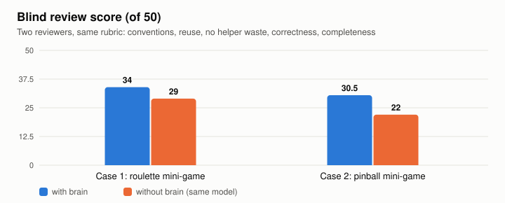

<h1 align="center">brain</h1>
<p align="center"><b>让 Claude Code 记住上次弄明白的事情的长期记忆技能</b></p>

<p align="center">
  <a href="README.md">English</a> · <a href="README.ko.md">한국어</a> · <a href="README.ja.md">日本語</a> · <b>简体中文</b>
</p>

<p align="center">
  <a href="LICENSE"></a>
  <a href="https://claude.com/claude-code"></a>
  
  
</p>

<p align="center">
  <a href="https://cdn.jsdelivr.net/gh/FuJiGraphics/claude-brain@media/brain-promo-zh-720p.mp4">
    
  </a>
  <br><sub>▶ <a href="https://cdn.jsdelivr.net/gh/FuJiGraphics/claude-brain@media/brain-promo-zh-720p.mp4">观看 1 分钟视频</a>(画面中的项目和记忆都是为演示虚构的)</sub>
</p>

在同一个项目里和 Claude Code 一起工作几周之后,常常会遇到这样的情况:上周一起查出来的坑、两个月前定下的规则,又得重新解释一遍。要是忘了解释,同样的错误往往会再犯一次。

brain 会从对话中自动挑出这些内容记下来。之后当 Claude 打开与某条记忆有关的文件、执行相关命令或遇到相关错误时,brain 会把那条记忆交给 Claude。不需要专门去调用,所有记忆文件都以普通的 Markdown 保存在你自己的电脑上。

```bash
git clone --single-branch https://github.com/FuJiGraphics/claude-brain.git ~/.claude/skills/brain
bash ~/.claude/skills/brain/scripts/install.sh
```

安装之后,请在你正在工作的项目文件夹里,对 Claude Code 输入一次 `/claude-brain-register`。这个项目会马上开始积累记忆。之后照常使用就可以了,想看看积累了哪些记忆时,输入 `/claude-brain-app` 即可。

## 安装后会有哪些变化

**不用再重复解释同样的事。** 比如 Claude 正要修改支付代码时,brain 会把以前确认过的事实这样交给它:

```
[记忆] 关于 `PaymentClient` 记得的内容(过去确认的事实,可能与现在的代码不同)。
- 支付重试会复用幂等键 - 新建一个会导致重复扣款 (projects/shop/lessons/payment-retry-reuses-key.md)
```

会话开始时会先展开一次项目的记忆地图(索引),工作中只把和当下相关的一两条记忆交出去,没有相关的就不再多放。这和每次会话都把一大篇文档整个读进去的做法很不一样。

**不用开口,记忆也会自己积累。** 一个在会话之外单独运行的代理(brain 里叫它*海马*)会回顾对话记录,只把值得长期保存的内容连同依据一起记下来,比如你的纠正、做过的决定、花了很久才查清的原因。

**记忆会自己整理。** 每天晚上合并重复的记忆,超过 45 天没用到的记忆不会删除,只是收到后面去。决定和坑这类重要的记忆会保留 120 天。

**看得见,也改得了。** 在 brain 应用里,可以看到每个项目各自长大的大脑,用大白话读懂 AI 写的笔记,发现记错了点一下按钮就能纠正。

<p align="center">
  
</p>

## 真的有区别吗

我们在一个真实项目里,让 Claude 把同一个功能实现了两次:一次装了 brain,一次不装。模型、需求、起始提交完全相同,再由两个不知道哪一边是 brain 的 Opus 5.5 评审模型打分。

<p align="center">
<picture><source media="(prefers-color-scheme: dark)" srcset="benchmarks/2026-09-30/score-dark.svg"></picture>
</p>

| | 案例 1:转盘小游戏 | 案例 2:弹珠台小游戏 |
|---|---|---|
| 评审得分(满分 50,2 次评审平均) | **brain 34** / 不装 29 | **brain 30.5** / 不装 22 |
| 评审的选择 | brain 2 / 2 | brain 2 / 2 |
| 用时 | 9.9 分钟 / 6.9 分钟 | 13.9 分钟 / 4.7 分钟 |
| 费用(按 API 价格换算) | $2.98 / $1.96 | $3.37 / $1.12 |

差别来自代码和文档里没有写下来的知识。

- 只在对话里定下的规则:这个项目两个月前在对话中定好表格数据统一用 TSV 交接,仓库里哪里都没写。装了 brain 的一边遵守了这条规则,不装的一边直接改了本地 JSON。
- 费了很大劲才找到的坑:这样的坑有两个,装了 brain 的一边都避开了,不装的一边两个都踩了。"重新打开缓存的弹窗时不会执行初始化"就是其中之一。
- 功能应该放在哪里:装了 brain 的一边把管理器、弹窗和结算都接进了现有的活动流程,不装的一边只做了一个独立的小游戏。

代价是花了更多时间和钱(时间 1.4 到 3.0 倍,费用 1.5 到 3.0 倍)。多出来的部分大多用在读取和核对记忆上;在案例 2 里,装了 brain 的一边还把现有的活动流程也接了进去,工作范围大了一倍左右。比起用完就扔的脚本,持续几周以上的项目收益更明显。

<details><summary>测试方法与局限</summary>

- 两边的模型都是 Sonnet 5.5,effort medium。
- 不装的一边用 `claude -p --restricted` 关掉了 CLAUDE.md、自动记忆和用户设置,只能读仓库里的文件。装了 brain 的一边在同样条件下只多了 brain 的钩子和一行记忆说明。我们检查了对话记录,确认记忆只进入了装了 brain 的一边。
- 评审由两个 Opus 5.5 模型负责,看的是规范、对现有结构的利用、重复、行为是否正确以及完成度。
- 只有 2 个案例,每个条件各跑 1 次,所以请把它当作初步的信号,而不是统计上确定的结论。同一天做的"只做一次规划"测试(18 个真实任务,3 种模型)中没有质量差异。我们认为一次性的规划很少需要这种上下文知识。
- 原始数据: [`benchmarks/2026-09-30/results.json`](benchmarks/2026-09-30/results.json)

</details>

## 和其他方法有什么不同

最大的区别在于记忆**在什么时候、由谁判断**进入上下文。以下根据 2026 年 10 月各项目的官方文档整理。

| | 谁来写记忆 | 怎样被想起 | 整理与遗忘 | 存放位置 |
|---|---|---|---|---|
| **brain** | 后台代理从对话记录中提取(+ 用户反馈) | **按文件、命令、错误自动想起**,在需要的那一刻 | 每晚合并、收起、统计使用次数、检查链接 | 本地 Markdown |
| `CLAUDE.md` / rules | 用户(或在要求时由 Claude) | 会话开始时整个载入 | 无 | 本地文件 |
| Claude Code 自动记忆 | 会话中由 Claude | 启动时载入 `MEMORY.md` 开头,主题文件在 Claude 读取时 | 接近上限时提示整理 | 本地 |
| [claude-mem](https://github.com/thedotmack/claude-mem) | 钩子收集,工作进程总结 | 启动时注入最近的会话,用 MCP 搜索 | 文档中没有 | 本地 SQLite |
| [Mem0 MCP](https://docs.mem0.ai/platform/mem0-mcp) | 代理调用 `add_memory` | 需要代理主动搜索 | 开源版只会添加 | 云端或自托管 |
| [Basic Memory](https://github.com/basicmachines-co/basic-memory) | 代理通过 MCP 写笔记 | 需要代理主动搜索 | 手动 | 本地 Markdown |
| [MCP memory 服务器](https://github.com/modelcontextprotocol/servers/tree/main/src/memory) | 代理创建实体 | 需要代理读取或搜索 | 无 | 本地 JSONL |
| [Cline Memory Bank](https://docs.cline.bot/customization/memory-bank) | 说 "update memory bank" 时由 Cline | 每次任务读取全部文件 | 无 | 项目 Markdown |
| [Cursor rules](https://cursor.com/docs/context/rules) | 用户(自动记忆在 2.1 中移除) | 始终、按描述、按 glob | 无 | 项目、控制台 |
| [Windsurf memories](https://docs.devin.ai/desktop/cascade/memories) | Cascade 自动写 | Cascade 判断相关时 | 文档中没有 | 本地 |
| [Copilot Memory](https://docs.github.com/en/copilot/concepts/agents/copilot-memory) | Copilot,并附上引用依据 | 使用前用当前分支验证 | 28 天不用即过期 | GitHub 服务器 |

该选哪一个?每个会话都需要的少数几条规则,最适合放在 `CLAUDE.md` 里。brain 在旁边负责那些很难全写进 `CLAUDE.md` 的成百上千个小坑和小决定。如果需要多个工具或多个人共用一份记忆,Mem0、Basic Memory 这类 MCP 记忆会更合适。brain 只在一台机器上、只配合 Claude Code 工作。

## brain 应用

输入 `/claude-brain-app`,会弹出一个手机形状的小窗口。它以 Chrome 或 Edge 的应用模式运行,这台电脑以外无法访问。

<p align="center">
  
  &nbsp;
  
</p>

- 每个项目各自长大的大脑:随着记忆增多,会从蛋长成宝宝、小朋友、大人,直到贤者。心情会随脑袋重量、海马的失败、睡眠和学习等真实状态而变化。
- 气泡:用几个词展示这个大脑最看重的话题。点一下就能把相关记忆集中查看。
- 大白话解释:AI 写的笔记又短又硬,不好读。打开一条记忆,会先看到一句话总结、为什么记住、什么时候会想起,以及难懂词语的解释。
- 反馈:每条记忆都附有一个问题,比如"现在还是用 release 脚本部署吗?"。在"对,没错""变了""很重要""不再需要"中选一个,反馈会先放进邮箱,在邮箱里点"一次性发给海马"就会交给海马。处理完成后应用会提醒你。
- 提问:可以和项目的大脑聊天。它只根据自己的记忆回答,并列出用作依据的记忆。
- 喂食和大脑整理:可以直接告诉它一定要记住的事,也可以在脑袋变重时交给海马整理。
- 还不认识的项目:列出最近用 Claude Code 工作过、但还没登记的文件夹。点"养育",一两分钟内就会长出这个项目的大脑。
- 沉睡的记忆和归档:长期不用而收起的记忆在记忆本的"沉睡的记忆"里,海马整理时放下的记忆在"归档"里。归档里的记忆需要时可以找回。
- 休息:可以只让某个项目里的 brain 暂时休息。
- 用量和备份:在设置里可以查看 brain 本周用了多少 Claude 用量,也可以把记忆备份成一个 zip。

应用不会直接修改记忆文件。喂食、反馈和整理请求都会进入海马的任务队列,所以修改记忆文件的始终只有海马。

### 工作性格

可以为每个项目设定 Claude 的工作方式。从松鼠(快速)、猫头鹰(先计划再确认)、猫(提问和建议)、乌龟(慢但准确)中选一个,也可以自己把倾向连接到不同的情境上。

| 强度 | 会发生什么 |
|---|---|
| 轻 | 会话开始时用一句话告诉它 |
| 普通 | 另外,每次请求时用一行提醒 |
| 一定! 🔒 | 另外,由钩子直接把关:在 `rm -rf`、`push --force`、`reset --hard`、部署等命令之前先问你;如果没有构建或测试就想结束,会被退回一次 |

预览里显示的句子,就是 Claude 实际收到的句子。

## 命令

大多数命令由钩子直接处理,不消耗 token。结果会以你设置的语言显示。

| 命令 | 作用 |
|---|---|
| `/claude-brain-app` | 打开 brain 应用 |
| `/claude-brain-status` | 开关状态、海马的任务与失败、上次夜间整理、最近的回忆、本周用量 |
| `/claude-brain-register` | 立即登记当前项目 |
| `/claude-brain-on`、`/claude-brain-off` | 开启或关闭 brain。后面加 `here` 只对当前项目生效 |
| `/claude-brain-config [default\|eco\|quality]` | 选择海马的模型:Sonnet medium / Sonnet low / Opus high。也可以用 `lang zh` 这样切换语言 |
| `/claude-brain-model`、`/claude-brain-effort` | 分别设置海马的模型和 effort |
| `/claude-brain-remember <内容>` | 直接告诉它要记住的内容 |
| `/claude-brain-recall <名称>...` | 按文件、符号、API、错误或症状查找记忆 |
| `/claude-brain-sleep` | 立即运行夜间整理 |
| `/claude-brain-results` | 查看海马做了什么 |
| `/claude-brain-stop` | 当前任务完成后停止海马 |
| `/claude-brain-update` | 获取新版本(记忆保持不变) |
| `/claude-brain-backup` | 把记忆和性格备份成一个 zip |

## 费用与隐私

- 回忆不会另外调用 API。不过会给上下文增加一些内容:会话开始时的项目记忆地图(最多约 6,000 字)、每次请求的一行习惯提醒,以及工作中想起的记忆(每个会话平均约 2,000 字,上限 9,000 字)。每次钩子大约耗时 25ms。
- 海马会使用你的 Claude 用量。每个任务运行一次 `claude -p`(默认 Sonnet 5.5,effort medium)。在演示用的记忆库上测得:记录一次 0.06 到 0.13 美元,整理一次 0.05 到 0.11 美元(按 API 价格)。真实项目的记忆越多,费用会稍高一些。想省一点的话,可以试试 `/claude-brain-config eco`。
- 应用的 AI 功能(气泡、大白话解释、提问)会调用 Claude Haiku,每次约 0.002 到 0.004 美元。解释会缓存起来。
- 用了多少,随时可以在 `/claude-brain-status` 和应用设置的"用量"里查看。如果你用的是 Pro 或 Max 订阅,这个金额是用量的参考,不是实际收费。
- 记忆文件只保存在这台电脑上。不过 Claude 会话、海马和应用调用 Claude 时,相关的记忆内容会放进提示词发送到 Anthropic API。海马在需要核实时可能会搜索或读取网页(WebFetch、WebSearch)。此外每天检查一次新版本(`git fetch`),不需要的话在 `~/.claude/skills/brain/.active/config` 里写上 `update_check=0` 即可。应用只监听 `127.0.0.1`,每次启动都会换一个新的令牌。
- 海马不经确认提示直接运行,因为后台任务没有人可以确认。作为代价,git 写操作、`rm`、`sudo`、修改设置文件和其他技能都被拒绝规则挡住了。详见下面的[海马的权限](#hippocampus-permissions)。

## 安装、更新与备份

```bash
git clone --single-branch https://github.com/FuJiGraphics/claude-brain.git ~/.claude/skills/brain
bash ~/.claude/skills/brain/scripts/install.sh
```

在 Windows 上,请在 Git Bash(Claude Code 使用的 shell)中运行同样两行。安装重复运行结果也一样,修改过的设置文件会备份为 `<文件>.brain-bak-<时间>`。安装会做这些事:

1. 在 `~/.claude/settings.json` 中注册 brain 的钩子,不会动其他钩子。brain 的钩子在任何情况下都以正常的退出码结束,所以只要没有把性格设为"一定!",brain 就不会挡住工具调用。
2. 在 Claude Code 状态栏末尾加上 `[BRAIN]` 标记,原来的状态栏保持不变。
3. 在 `~/.claude/CLAUDE.md` 中加一行,说明 `[记忆]` 消息是什么。测试发现没有这一行时,Claude 会把记忆当成来历不明的文字而忽略。
4. 安排每天 04:30 运行夜间整理(macOS 用 launchd,Windows 用任务计划程序)。Linux 请自己把 `scripts/sleep.sh` 加到 cron。
5. 创建 `/claude-brain-*` 命令,并根据系统语言设置语言。

### 登记项目

brain 只在登记过的项目里工作。最近 7 天内有 3 个以上会话、10 个以上请求的 git 文件夹,每晚会自动登记一个。想马上开始的话,在那个文件夹里输入 `/claude-brain-register`,或者在应用首页的"还不认识的项目"里点"养育"。

### 更新

输入 `/claude-brain-update`,会获取新版本并重新运行安装。如果有手动改过的文件,它会停下来告诉你,而不是覆盖。有新版本时,应用首页和 `/claude-brain-status` 会显示提示。

<details><summary>2026 年 10 月 5 日之前安装的(只需一次)</summary>

旧版本把记忆文件夹(`cortex/`)的一部分交给 git 管理,所以 `git pull` 会因冲突而停止。只需运行一次下面的命令,就能在保留记忆的同时换到新的结构。

```bash
cd ~/.claude/skills/brain
cp -R cortex .active/cortex-backup          # 先把记忆复制一份
git checkout -- cortex && git pull          # 获取新版本
cp -R .active/cortex-backup/. cortex/       # 把记忆放回原处
bash scripts/install.sh
```

之后用 `/claude-brain-update` 更新就可以了。
</details>

### 备份和换电脑

用 `/claude-brain-backup`(或应用设置里的备份)可以把记忆和性格打包成一个 zip,保存在 `~/Downloads`。在新电脑上安装 brain 后,运行 `bash ~/.claude/skills/brain/scripts/backup.sh restore <zip 路径>` 即可。那台电脑上原有的记忆会先移到 `.active/before-restore-<时间>/` 再替换;如果用户名不同导致主文件夹路径变了,项目路径也会一并改好。海马正在工作时不会恢复,这时请先用 `/claude-brain-stop` 让它停下。

### 卸载

`bash ~/.claude/skills/brain/scripts/install.sh --uninstall` 会移除钩子、状态栏标记、CLAUDE.md 里的那一行、命令文件和夜间整理计划,并停止海马。记忆会一直保留,直到你删除文件夹。

## 常见问题

**只用 `CLAUDE.md` 不够吗?** 对于每个会话都需要的几条规则,`CLAUDE.md` 是最好的地方。不过它每次都会整个载入,需要人来写,也不会自己整理。brain 负责那些很难全写进 `CLAUDE.md` 的成百上千个小坑和小决定,并且只拿出和当前文件或错误相关的那几条。

**Claude Code 的自动记忆要开着吗?** 建议在 `~/.claude/settings.json` 里加上 `"autoMemoryEnabled": false` 关掉它。自动记忆没有纠错的机制,而且每个会话都会载入,旧笔记可能会和 brain 的新记忆冲突。

**记忆错了怎么办?** 在应用里打开那条记忆,点"变了",写下现在的情况,再从邮箱发出去。海马核实后会修改。每条记忆都带有确认日期,和现在的代码不一致时,永远以现在的代码为准。

**记忆会不会无限增长?** 每晚会合并重复的记忆,把长期不用的收起来。收起来的记忆仍然可以搜索到。应用里的"脑袋重量"会告诉你什么时候该整理了。

**只想在某个项目里关掉。** 在那个文件夹里输入 `/claude-brain-off here`,或者在应用的项目页面打开"在这个项目中休息"。记忆会原样保留。

**团队可以共用吗?** 目前还不行。记忆存放在每台机器上。可以用备份 zip 转移,但并不是为多人同时写入而设计的。

**Cursor 或 Codex 能用吗?** 很遗憾不能。它是基于 Claude Code 的钩子运行的。

**支持哪些语言?** 应用、命令结果、安装提示、会话中的文字和性格支持中文、英文、韩文和日文。记忆会以对话所用的语言积累,纠正、决定这类信号四种语言都能识别。可以在应用设置里切换,也可以用 `/claude-brain-config lang zh` 这样的命令。

**能看到会话里放进了什么吗?** `/claude-brain-status` 会显示最近 24 小时回忆的次数和字数,`~/.claude/skills/brain/.active/recall.log` 里保留了全部记录。

## 需要了解的地方

- 测量来自一个人的项目(macOS,主要是 Unity/C# 和 VS Code 扩展)。从错误中提取线索的规则是针对 C# 编译错误调整的。按打开或修改的文件名回忆的部分与语言无关;命令中的文件能识别常见语言的源码和配置文件扩展名,API 名能识别像 `PaymentClient.Charge(` 这样以大写字母开头的点号写法。
- Windows 支持目前是测试版。路径、钩子、任务计划程序和应用都已移植并检查过,但还没在真实的 Windows 机器上充分使用。遇到问题的话,欢迎提 Issue 告诉我们。
- 在依赖上下文的工作中,会多花时间和 token(请参考上面的测试)。
- 海马是在你电脑上无人监督运行的代理。虽然设有拒绝规则,如果你不放心,可以把 `scripts/hippocampus-perm.mode` 改成 `acceptEdits`。不过这样海马就无法写入记忆文件,brain 也就不再学习新东西(回忆照常可用)。

## 工作原理

名字借用了大脑的结构。

| 部件 | 在人的大脑里 | 在这个技能里 |
|---|---|---|
| **cortex** | 大脑皮层,巩固后的长期记忆 | Markdown 记忆库。分为 `common/`、`stacks/<技术栈>/`、`projects/<项目>/` 三层,每层有轻量的索引和记忆正文 |
| **thalamus** | 丘脑,筛选感觉并送到意识 | 钩子。把和当前文件、命令、错误相关的记忆交出去,会话开始时展开项目地图 |
| **hippocampus** | 海马,形成新记忆 | 后台的 `claude -p` 工作进程,也是唯一写入 cortex 的角色,负责登记、记录、重放和整理 |
| **sleep** | 睡眠,巩固并遗忘 | 每晚统计使用次数、遗忘、重放剩下的对话、从搜索失败中学习、整理、检查 |

```
[回忆 - 会话内]
工具调用 ─ 钩子 ─▶ thalamus ─▶ cortex 中相关的记忆 ─▶ [记忆] 消息进入会话

[记录 - 会话外]
回合结束、压缩之前、会话结束 ─▶ thalamus ─▶ 重放(清醒时) ──────────┐
每天 04:30 ─▶ sleep ─▶ 重放、搜索失败学习、整理 ─────────────────┴─▶ 队列 ─▶ hippocampus ─▶ cortex
```

Claude Code 本来就会保存的对话记录,充当了短期记忆。同一段对话只处理一次。

<details><summary><b>回忆 - thalamus</b></summary>

钩子挂在 SessionStart、UserPromptSubmit、PreToolUse(Edit、Write、MultiEdit、NotebookEdit、Bash、AskUserQuestion)、PostToolUse(Read)、PostToolUseFailure(Bash)、SubagentStart、Stop、PreCompact、SessionEnd 上,只在 `cortex/registry.md` 登记过的项目里生效。

| 钩子事件 | 线索 |
|---|---|
| SessionStart | 项目要点、项目的 `INDEX.md`(上限 3,000 字)、技术栈和公共索引(分别 2,000 字、1,200 字)、流程记忆的行 |
| UserPromptSubmit | 提醒在规划前先打开这次工作范围的索引的一行习惯 |
| PostToolUse (Read) | 打开的文件名 |
| PreToolUse (Edit、Write、MultiEdit、NotebookEdit) | 要修改的文件名、编辑内容中新出现的 API 名 |
| PreToolUse (Bash) | 命令读写的文件名、命令里代码的 API 名 |
| PostToolUseFailure (Bash) | C# 编译错误的文件和错误代码、异常名和第一个项目栈帧的文件 |
| SubagentStart | 工作文件夹所属的项目,以及说明 `[记忆]` 是什么的一行 |
| Stop、PreCompact、SessionEnd | 不回忆;如果新的对话片段很突出,就开始重放 |

- 没有相关记忆时什么都不输出。每次最多 1 到 2 条(Bash 为 1 条),每条 240 字以内,每个会话上限 40 条或 9,000 字(会话开始时的地图另算)。
- 如果一条线索同时命中 4 条以上不同的记忆,就视为太常见,只保留文件名中带有这条线索的记忆。
- 我们重放了 431 个过去的会话,用 Sonnet 判定了 371 次回忆。只在被判为"有干扰"比例低的地方回忆:打开文件(0 到 3%)、编辑之前(8% 到 20%)、命令涉及的文件(约 10%);比例高的请求文字(64%)、"不行"之类的结论(75%)、命令中的 CLI 名称(64%)不作为线索。
</details>

<details><summary><b>记录、睡眠与遗忘</b></summary>

| | 清醒时 | 睡眠 |
|---|---|---|
| 开始 | 回合结束、压缩之前、会话结束时在后台开始 | 每天 04:30;错过的话在醒来后补一次;用 `/claude-brain-sleep` 可立即运行 |
| 对象 | 上次处理位置之后新积累的对话片段 | 清醒时没能处理的片段 |
| 条件 | 4,000 字节以上、突出度 6 以上(压缩之前和会话结束时为 3 以上)。同一份记录 20 分钟一次(压缩之前和会话结束时除外),整体每小时 4 次 | 突出度 6 以上,取最高的 4 个 |

突出度的计分:用户纠正 3、表示决定的说法 3、要求记住 5、权限被拒 2、工具失败 1(最多 5)、反复调查 1(最多 3)、请求有 5 个以上时加 1。纠正、决定和要求记住都能识别中文、英文、韩文和日文的说法。

睡眠按以下顺序进行:统计使用次数和搜索失败、遗忘、重放剩下的片段(最多 4 个)并登记 1 个活跃的未登记项目、从搜索失败中学习、整理最久没整理的 3 个片段、检查。创建 `scripts/sleep.conf` 并写上 `FORGET_DAYS=60` 这样的行,就能修改默认值。

一条记忆在最后一次使用后过了 45 天(包含决定、坑、事故的记忆为 120 天),它的索引行会移到 `dormant.md`。正文仍然保留,可以搜索到;再次被使用时会回到原来的索引。海马在整理中舍弃的记忆会移到 `_archive/`,可以从应用的归档里找回。不会彻底删除任何东西。
</details>

<a name="hippocampus-permissions"></a>
<details><summary><b>海马的权限</b></summary>

> [!IMPORTANT]
> 海马默认不经确认提示直接运行(`scripts/hippocampus-perm.mode` 中的 `bypassPermissions`)。把 brain 放在 `~/.claude/skills/` 下时,记忆文件夹也在那下面,而 Claude Code 把 `.claude/` 当作受保护的路径,每次编辑都要确认。海马是非交互式的 `claude -p`,没有人可以确认。

- 这个设置只作用于海马进程,你自己的会话权限保持不变。
- 工具只限于 Read、Write、Edit、Grep、Glob、Bash、WebFetch、WebSearch,不接入 MCP 服务器和其他技能。
- git 写操作(`commit`、`push`、`checkout`、`reset` 等)、`rm`、`sudo`、`find -delete`,以及修改其他技能、`settings.json`、`CLAUDE.md`、`hooks/`,都由拒绝规则挡住。在这个模式下拒绝规则依然有效。
- 想关掉的话,运行 `echo acceptEdits > ~/.claude/skills/brain/scripts/hippocampus-perm.mode`。之后写入记忆都会被拒绝(`denied`),只留下判定结果,brain 也不再学习新东西。
</details>

<details><summary><b>设计背后的测量</b></summary>

| 事实 | 依据 |
|---|---|
| 写成命令口吻的钩子文字被怀疑是提示词注入,没有被遵守 | 在 Claude Code 2.1.283 上隔离运行,2026-09-29 |
| 没有 `CLAUDE.md` 里的那一行时,`[记忆]` 被当作来历不明的文字忽略 | 同一天 |
| "修改前先查笔记"的强制规则,在 6,300 次 Edit/Write 中有 20%、在 893 次 Bash 写入中有 32% 没有被遵守 | 拆分前结构的拦截记录 |
| 需要会话主动要求才会运行的整理,实际上从没运行过(队列 668 个任务中记录 322、整理 0) | 拆分前结构的队列记录 |
| 应用调用 Haiku 时,开启思考需 38 秒、0.024 美元,关闭后 6 秒、0.004 美元 | 2026-10-05 |
</details>

<details><summary><b>目录结构与运行要求</b></summary>

```
brain/
├── SKILL.md, commands/        # 控制面板、/claude-brain-* 命令模板
├── agents/hippocampus.md      # 海马的指南
├── scripts/                   # thalamus.py(钩子)、nbsearch.py(搜索)、hippocampus-*.sh、sleep.sh、install.sh、
│                              # update.py、backup.py、register.py、persona.py、lang.py、cli_i18n.py、plat.py …
├── editor/                    # brain 应用 (server.py + web/)
├── seed/cortex/               # 首次安装时使用的记忆库骨架
├── promo/                     # 宣传视频和截图工具(虚构的演示大脑)
├── cortex/                    # 记忆(在这台电脑上成长,不由 git 管理)
└── .active/                   # 运行时状态(不由 git 管理)
```

| | |
|---|---|
| Claude Code | 2.1.28x 或更高(在 2.1.283 上验证) |
| Python | 3.7 或更高(`python3`、`python`、`py` 之一) |
| `claude` CLI | 需要在 PATH 中(海马和应用会调用它) |
| Shell | bash 3.2 或更高;Windows 使用 Git Bash |
| 应用窗口 | Chrome(macOS、Linux)或 Edge(Windows)的应用模式,没有的话用默认浏览器 |
| 系统 | macOS(开发和测量的环境)、Windows(测试版)、Linux(可运行,夜间整理用 cron) |
</details>

## 许可证

[CC BY-ND 4.0](LICENSE)(署名-禁止演绎 4.0 国际)。Copyright (c) 2026 Cheol Jin Choi (FuJiGraphics).

| 项目 | 内容 |
|---|---|
| 商业使用 | 可以。在公司工作中或付费服务里使用都没问题 |
| 分享、再分发 | 保持原样即可 |
| 分发修改版 | 修改过或截取部分的版本不能分发 |
| 署名 | 请注明作者、仓库地址(https://github.com/FuJiGraphics/claude-brain)和许可证 |

如果想分发修改版,请另外联系作者。在你电脑上积累的记忆属于你自己,与本许可证无关。
